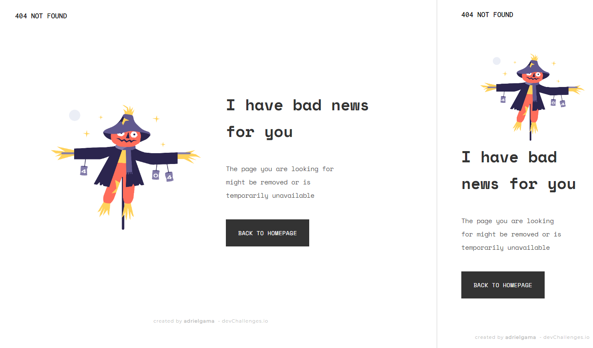

<!-- Please update value in the {}  -->

<h1 align="center">404 Error</h1>

   Solution for a challenge from  <a href="http://devchallenges.io" target="_blank">Devchallenges.io</a>.

  <h4>
    <a href="https://devchallenges.io/challenges/wBunSb7FPrIepJZAg0sY">
      Challenge
    </a>
  </h3>

  <a href="#technologies">Technologies</a> &#xa0; | &#xa0; 
  <a href="#features">Features</a> &#xa0; | &#xa0; 
  <a href="#contact">Contact</a> &#xa0; | &#xa0; 

### Technologies

<!-- This section should list any major frameworks that you built your project using. Here are a few examples.-->

- 
- 
<!-- -   -->

## Features

<!-- List the features of your application or follow the template. Don't share the figma file here :) -->

This application/site was created as a submission to a [DevChallenges](https://devchallenges.io/challenges) challenge. The [challenge](https://devchallenges.io/challenges/wBunSb7FPrIepJZAg0sY) was to build an application to complete the given user stories.

## Contact

- Website [adrielgama.github.io](https://adrielgama.github.io)
- GitHub [@adrielgama](https://github.com/adrielgama)
- Linkedin [Adriel Gama](https://www.linkedin.com/in/adrielgama/)
